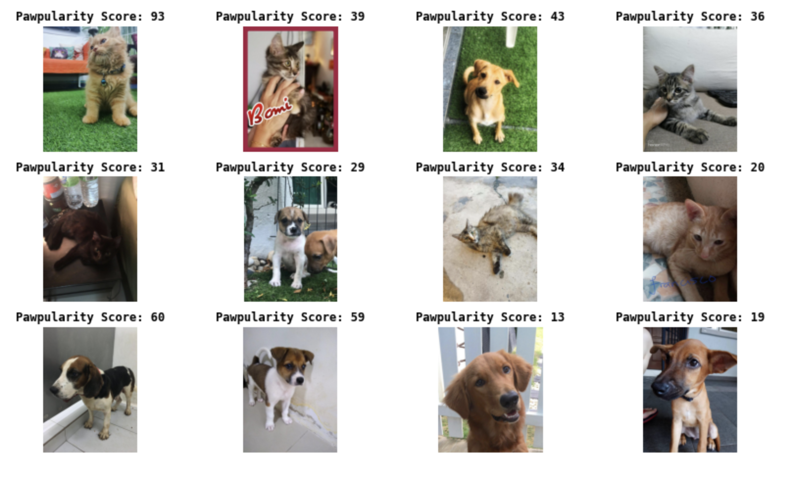
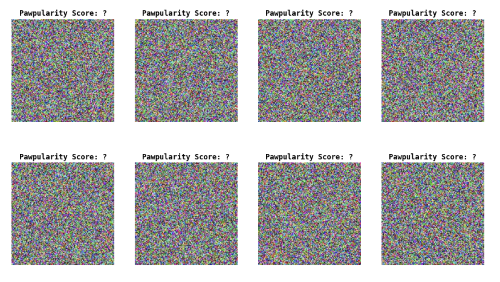

# Pawpularity-Prediction

## General info

This is my code for PetFinder.my - Pawpularity Contest on Kaggle. The goal of the contest is to develop models based on 9000+ scored images of dogs and cats, and predict pawpularity score for future pets.

  

  

## Tools

Tensorflow, Keras, Sklearn, XGBoost

## Methods

I implemented pre-trained Resnet152_Top_ImageNet model combined with neural network, supporting vector regression and boosted regression.
The final Pawpularity was obtained based on the weighted sum of predictions from three models.
